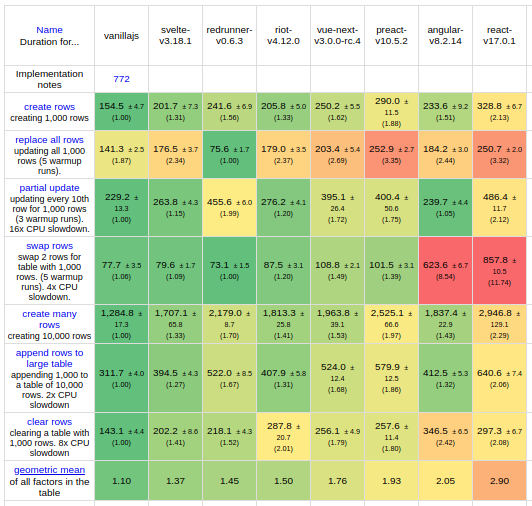

# RedRunner

*A small JavaScript framework with legs.*

## Overview

RedRunner is a JavaScript framework for building dynamic pages and apps.

It looks like a cross between Vue and React, but works very differently, and because of that:

1. It is a lot faster.
2. It produces smaller bundles.
3. You can solve many problems more easily.

#### How fast is it?

Preliminary tests using [js-framework-benchmark](https://github.com/krausest/js-framework-benchmark) place it ahead of most of the better known frameworks:



**Footnotes:**

1. *This is a screenshot from locally run tests, not the official figures (RedRunner hasn't been submitted yet)*
2. *I omitted a few test as I wasn't sure if my implementation breached the rules on direct DOM manipulation, thereby gaining unfair advantage.*
3. *RedRunner hasn't been optimised as extensively as the others, so will likely get even faster.*

Benchmark speed is not the same as real world performance. What really matters in the real world is how **quickly** and **cleanly** you can fix *specific* performance issues (and those happen regardless of which framework you use).

#### How small is it?

The size of the framework itself is irrelevant, what matters are bundle sizes.

Here are the production build sizes for implementations of the same app (the one used in the above benchmark) in kB, minified & gzipped:

```
React 17.0       42.3
Angular 8.2      39.7
Vue 3.0          20.7
Riot 4.12         8.4
Preact 10.5       5.4
RedRunner 0.6     4.9
Svelte 3.28       3.2
```

#### What does it look like?

You compose views as ES6 classes (like React) but build use a declarative syntax in the HTML, like Vue, Angular and others:

```javascript
import {View, mount} from 'redrunner'

class ClickCounter extends View {
  __html__ = `
    <div>
      <button :onClick=".btnClick">Click me</button>
      <span>Clicks: {..clickCount}</span>
    </div>
  `
  btnClick() {
    this.props.clickCount ++
    this.update()
  }
}

mount('#some-div-id', ClickCounter, {clickCount: 0})
```

But don't panic.

* You can keep your HTML in separate file if you'd rather (I prefer seeing it next to the code)
* Your editor probably has a way to highlight the HTML (I use vscode, and can even get tailwindcss autocompletion in the `__html__` string)
* The syntax is extremely simple `.btnClick` means `this.btnClick` and `..clickCount` means `this.props.clickCount` - and the rest is really easy too. In fact, if you leave a directive empty (e.g. `<button :onClick="">`  or `<span>Clicks: {}</span>`) then you get a printout telling you how to use it (TBI).

But unlike those frameworks RedRunner interprets the syntax at build time, rather than run time (hence the smaller bundles and fast DOM operations). This is exactly how Svelte achieves its exceptional performance.

#### What are the cool tricks?

Here are my top four:

##### 1. Define your own syntax

RedRunner uses directives inside the view's HTML strings:

```html
<div :show="isSelected">
    I'm only visible if props.isSelected === true.
</div>
```

You can modify, alias, extend or add your own directives by configuring the babel plugin which compiles the code. This won't affect bundle size or or performance one bit, as directives are interpreted during the build step, not at run time.

##### 2. Bubble up actions

You can call a function in any parent component from nested component, using the bubble method:

```javascript
class TicTacToeGame extends View {
  __html__ = `<HTML for game...>`
  squareClicked(coords) {
    //whatever
  }
}

class Square extends View {
    __html__ = `<HTML for grid...>`
}

class Square extends View {
  __html__ = `<HTML for square...>`
  onClick() {
    this.bubble('squareClicked', this.props.coords)
  }
}
```

Bubble will crawl up the parent views in the tree until it finds the method, meaning you don't need to know how many layers deep your component is nested.

This is a lot nicer than packing functions into props like you would in React.

##### 3. Seamless direct DOM updates

First let's make the `<span>` in the ClickCounter display in red if the count goes above 5, and disappear altogether if it goes above 10:

```javascript
class ClickCounter extends View {
  __html__ = `
    <div>
      <button :onClick=".btnClick">Click me</button>
      <span :show="clickCount: n <= 10" :css="clickCount: n > 5 ? 'red' : ''">
        Clicks: {clickCount}
      </span>
    </div>
  `
  // as before
}
```

That's very declarative, but duplicates the word `clickCount` quite a bit. 

Let's change this to use the `:w` directive which tells the view to watch the value of `clickCount` and call a function when it changes, passing the new value, old value and the wrapper as arguments:

```javascript
class ClickCountDisplay extends View {
  __html__ = `
    <span :w="clickCount|.updateSpan"></span>
  `
  updateSpan(n, o, w) {
    w.text(`Clicks: ${n}`).css(n > 5 ? 'red' : '').visible(n <= 10)
  }
}
```

A wrapper is an object with which we can directly manipulate DOM element it wraps. 

Declarative purists will shout "Blasphemy! Direct DOM manipulation is evil!" but the more pragmatic person sees there is nothing wrong with it when done in response to data change, in an isolated scope, and using clean syntax. 

Both versions do exactly the same thing, in fact the first one compiles to pretty much the same as code as we wrote in our function. In either case, nothing gets evaluated unless `clickCount` has changed.

##### Total freeDOM

That last example didn't achieve much except for (arguably) improving readability. But being able to work with the DOM directly, yet cleanly, lets us do some things with ease that are fiendishly difficult in other frameworks.

1. Tweak performance by reducing duplicate calculations
2. Easily control animations
3. Entirely bypass what would be major issues in other frameworks

This view has a button which displays a click count, and also moves from one div to another whenever it is clicked. Note how we can manually move the button around without clashing with the framework control of the button's text:

```javascript
class ClickMove extends View {
  __html__ = `
    <div>
      <div :el="div1">
         <button :onClick=".btnClick">{{clickCount}}</button>
      </div>
      <div :el="div2"></div>
    </div>
  `
  btnClick(e, w) {
    this.props.clickCount ++
    const moveTo = this.props.clickCount % 2 ? 'div1' : 'div2'
    this.el[moveTo].child(w)
    this.update()
  }
}
```

Moving elements around (say a large drop down box reused in every row in a data grid) is just one example of a performance hack which is a piece of cake with direct DOM manipulation, yet painfully hard to pull off in a purely declarative way.

React finally produced a way to do this [four years after it was first requested](https://github.com/facebook/react/issues/3965), which likely means 100's of devs have collectively wasted 1000's of hours looking for a way to achieve that in their projects.

## Demo

There is a very minimal demo app, which you can run like so:

```
git clone git@github.com:andyhasit/redrunner.git
cd redrunner/demo
npm i
npm run start
```

You can also inspect the bundle size:

```
npm run build-prod
gzip dist/main.js
ls -lh dist
```

## Installation

#### Quick start

For new projects use the [demo](https://github.com/andyhasit/redrunner/tree/master/demo) as a starting point. For existing projects you can copy the relevant parts from **package.json** and **webpack.config.js** into your project.

Alternatively, you can install RedRunner manually with npm and follow the rest of the instructions here.

```
npm i -D redrunner
```

This will install **redrunner** and a compatible version of **babel-plugin-redrunner**.

#### Babel configuration

You must include the following plugins ***in this order*** in your babel configuration:

```json
"plugins": [
  ["babel-plugin-redrunner"],
  ["@babel/plugin-proposal-class-properties"]
]
```

The `babel-plugin-redrunner` transforms parts of your code and is required for RedRunner to work.

#### Bundling

I recommend using [webpack](https://webpack.js.org/) instead of alternatives as it gives you better control over source maps, which really helps for development.

#### Source maps

The babel plugin replaces each view's `__html__` field with generated code, and debugging is a lot easier if you can see that generated code.

With webpack you can set the config's `devtools` to something like `'eval-cheap-source-map'` which makes the source maps show the *transformed* code, but preserves the module separation which is nice. However this will include *all* transformations, so if you're transpiling to ES5 (which you probably do using a preset) then it will make it harder to track your own code.

One solution is not transpile to ES5 during development, meaning the only transformations you'll see are RedRunner's, which makes debugging a lot nicer.

The [demo's webpack.config.js](https://github.com/andyhasit/redrunner/tree/demo/webpack.config.js) file shows one way to achieve this. 

You can read more about webpack's devtools option [here](https://webpack.js.org/configuration/devtool/).

## User Guide

This is coming, but so is Christmas.

## Contributing

Contributions welcome, see the [main repo](https://github.com/andyhasit/redrunner).

## License

MIT